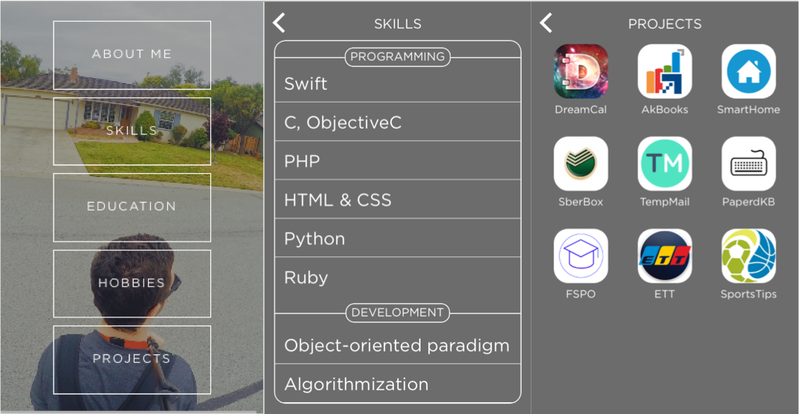
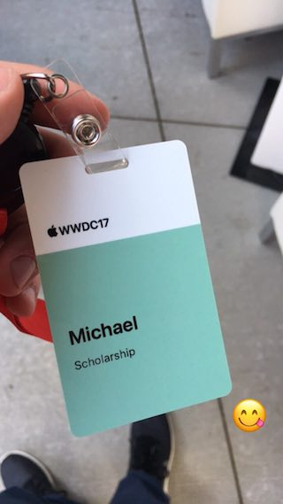

# Apple WWDC17 Scholarship submission

*Accepted*

> WWDC Scholarships reward talented students and STEM organization members with the opportunity to attend this year’s conference. Developers selected for a scholarship will receive a WWDC 2017 ticket and lodging free of charge.

This year task was to create a visually interactive scene in a Swift playground that can be experienced within three minutes.
I simply made a self-describing playground which included such aspects of my life as skills, education, hobbies and projects I've made.
Submission had to have not only a playground in it, but few essays about sharing the knowledge I'm going to receive and motivation too.

**Swift 3, Xcode 8**

Speaking of technologies used, my playground is based on **UIKit**.
* **CoreAnimation** is also used a lot.
* Some things are made with **QuartzCore**
* Delightful feeling is provided by **AVFoundation** which plays background music.
* Different custom font workarounds are made using **CoreText**.
* It would also be impossible not to use **CoreGraphics** which is everywhere in my playground.

Here is a screenshot of my Swift playground

---

WWDC17 was simply awesome!

